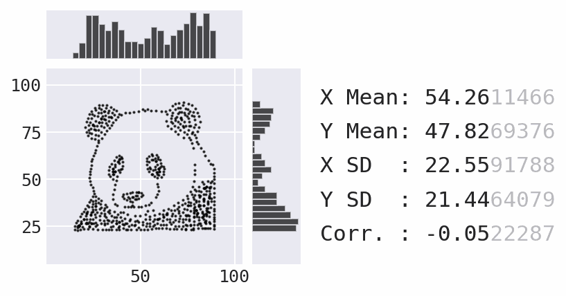

Quick Start Guide
=================

.. toctree::
   :hidden:

.. INSTALLATION

Installation
------------
Data Morph can be installed from PyPI using ``pip``:

.. code:: console

   $ python -m pip install data-morph-ai

Alternatively, Data Morph can be installed with ``conda`` by specifying the ``conda-forge`` channel:

.. code:: console

   $ conda install -c conda-forge data-morph-ai

.. USAGE INTRO

Usage
-----

Once installed, Data Morph can be used on the command line or as an importable Python package.

.. USAGE START

Command line usage
~~~~~~~~~~~~~~~~~~

.. CLI USAGE START

Run ``data-morph`` on the command line:

.. code:: console

   $ data-morph --start-shape panda --target-shape star

This produces the following animation in the newly-created ``morphed_data`` directory
within your current working directory:

   Morphing the panda :class:`.Dataset` into the star :class:`.Shape`.

You can smooth the transition with the ``--ease`` or ``--ease-in`` and ``--ease-out`` flags.
The ``--freeze`` flag allows you to start the animation with the specified number of frames
of the initial shape:

.. code:: console

   $ data-morph --start-shape panda --target-shape star --freeze 50 --ease

Here is the resulting animation:

   Morphing the panda :class:`.Dataset` into the star :class:`.Shape` with easing.

----

The CLI generates animations for the Cartesian product of the datasets and shapes
provided. For example, if you wanted to morph both the music and soccer datasets
into both the heart and diamond shapes (i.e., four animations), you could run
the command below:

.. code:: console

   $ data-morph --start-shape music soccer --target-shape heart diamond

.. tip::

   When doing generating multiple animations, it is recommended that you also specify
   the number of jobs you want to run in parallel (limited by the number of CPU cores
   on your machine). If you pass ``0``, Data Morph will run as many as possible:

   .. code:: console

      $ data-morph --start-shape music soccer --target-shape heart diamond --workers 0

   If you have the GNU ``parallel`` command on your machine, you can use it to run
   a slightly faster parallelized Data Morph (since it incurs less Python overhead),
   in which case you don't need to provide the worker count:

   .. code:: console

      $ parallel --progress -j0 \
      >     data-morph --start-shape {1} --target-shape {2} \
      >     ::: music soccer ::: heart diamond

   Check out the `GNU parallel documentation <https://www.gnu.org/software/parallel/sphinx.html>`_
   for more options.

----

See all available CLI options by passing in ``--help`` or consulting the :doc:`cli`:

.. code:: console

   $ data-morph --help

.. CLI USAGE END

Python usage
~~~~~~~~~~~~

.. PYTHON USAGE START

The :class:`.DataMorpher` class performs the morphing from a :class:`.Dataset` to a :class:`.Shape`.
Any :class:`~pandas.DataFrame` with numeric columns ``x`` and ``y`` can be a :class:`.Dataset`.
Use the :class:`.DataLoader` to create the :class:`.Dataset` from a file or use a built-in dataset:

.. code:: python

   from data_morph.data.loader import DataLoader

   dataset = DataLoader.load_dataset('panda')

For morphing purposes, all target shapes are placed/sized based on aspects of the :class:`.Dataset`.
All shapes are accessible via the :class:`.ShapeFactory`:

.. code:: python

   from data_morph.shapes.factory import ShapeFactory

   shape_factory = ShapeFactory(dataset)
   target_shape = shape_factory.generate_shape('star')

With the :class:`.Dataset` and :class:`.Shape` created, here is a minimal example of morphing:

.. code:: python

   from data_morph.morpher import DataMorpher

   morpher = DataMorpher(
       decimals=2,
       in_notebook=False,  # whether you are running in a Jupyter Notebook
       output_dir='data_morph/output',
   )

   result = morpher.morph(
       start_shape=dataset,
       target_shape=target_shape,
       freeze_for=50,
       ease_in=True,
       ease_out=True,
   )

.. note::

   The ``result`` variable in the above code block is a :class:`~pandas.DataFrame` of the data
   after completing the specified iterations of the simulated annealing process. The :meth:`.DataMorpher.morph`
   method is also saving plots to visualize the output periodically and make an animation; these end up in
   ``data_morph/output``, which we set as :attr:`.DataMorpher.output_dir`.

.. PYTHON USAGE END

----

.. VIZ LISTINGS

In this example, we morphed the built-in panda :class:`.Dataset` into the star :class:`.Shape`. Be sure to try
out the other built-in options:

* The :attr:`.DataLoader.AVAILABLE_DATASETS` attribute contains a list of available datasets, which
  are also visualized in the :class:`.DataLoader` documentation.

* The :attr:`.ShapeFactory.AVAILABLE_SHAPES` attribute contains a list of available shapes, which
  are also visualized in the :class:`.ShapeFactory` documentation.

For further customization, the :doc:`tutorials/custom-datasets` tutorial discusses how to generate custom
input datasets, and the :doc:`tutorials/shape-creation` tutorial discusses how to generate custom target shapes.
