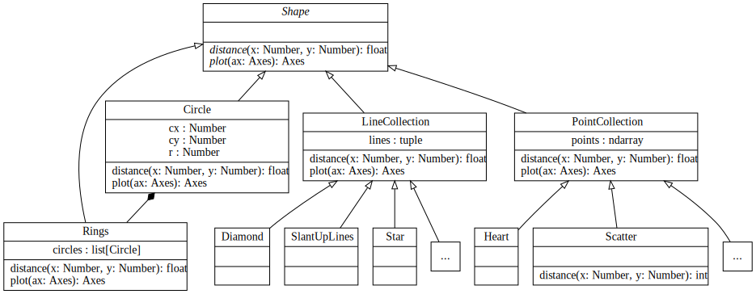

Shape Creation
==============

This tutorial walks you through the process of creating a new shape
for use as a target in the morphing process.

.. contents:: Steps
    :depth: 1
    :local:
    :backlinks: none

----

Select the appropriate base class
---------------------------------

All Data Morph shapes are defined as classes inside the :mod:`.shapes` subpackage.
Data Morph uses a hierarchy of shapes that all descend from an abstract
base class (:class:`.Shape`), which defines the basics of how a shape
needs to behave (*i.e.*, it must have a ``distance()`` method and a
``plot()`` method).

Any new shape must inherit from :class:`.Shape` or one of its
child classes:

* If your shape is composed of lines, inherit from :class:`.LineCollection`
  (*e.g.*, :class:`.Star`).
* If your shape is composed of points, inherit from :class:`.PointCollection`
  (*e.g.*, :class:`.Heart`).
* If your shape isn't composed of lines or points you can inherit directly from
  :class:`.Shape` (*e.g.*, :class:`.Circle`). Note that, in this case, you must
  define both the ``distance()`` and ``plot()`` methods (this is done for you
  if you inherit from :class:`.LineCollection` or :class:`.PointCollection`).

Define the scale and placement of the shape based on the dataset
----------------------------------------------------------------

Each shape will be initialized with a :class:`.Dataset` instance. Use the dataset
to determine where in the *xy*-plane the shape should be placed and also to scale it
to the data. If you take a look at the code for the existing shapes, you will see
that they use various bits of information from the dataset, such as the
automatically-calculated bounds (*e.g.*, :attr:`.Dataset.data_bounds`, which form
the bounding box of the starting data, and :attr:`.Dataset.morph_bounds`, which
define the limits of where the algorithm can move the points) or percentiles using
the data itself (see :attr:`.Dataset.data`). For example, the :class:`.XLines`
shape inherits from :class:`.LineCollection` and uses the morph bounds
(:attr:`.Dataset.morph_bounds`) to calculate its position and scale:

.. code:: python

    from data_morph.data.dataset import Dataset
    from data_morph.shapes.bases.line_collection import LineCollection

    class XLines(LineCollection):

      def __init__(self, dataset: Dataset) -> None:
         (xmin, xmax), (ymin, ymax) = dataset.morph_bounds

         super().__init__([[xmin, ymin], [xmax, ymax]], [[xmin, ymax], [xmax, ymin]])

Since we inherit from :class:`.LineCollection` here, we don't need to define
the ``distance()`` and ``plot()`` methods (unless we want to override them).

Test out the shape
------------------

Defining how your shape should be generated from the input dataset will require
a few iterations. Be sure to test out your shape on different datasets:

.. code:: python

   from data_morph.data.loader import DataLoader
   from data_morph.morpher import DataMorpher

   dataset = DataLoader.load_dataset('panda')
   target_shape = YourShape(dataset) # TODO replace with your class

   morpher = DataMorpher(
       decimals=2,
       in_notebook=False,  # whether you are running in a Jupyter Notebook
       output_dir='data_morph/output',  # where you want the output to go
   )

   result = morpher.morph(start_shape=dataset, target_shape=target_shape)

Some shapes will work better on certain datasets, and that's fine. However,
if your shape only works well on one of the built-in datasets (see the
:class:`.DataLoader`), then you need to keep tweaking your implementation.

(Optional) Contribute the shape
-------------------------------

If you think that your shape would be a good addition to Data Morph, `create an issue
<https://github.com/stefmolin/data-morph/issues>`_ in the Data Morph repository proposing
its inclusion. Be sure to consult the `contributing guidelines`_ before doing so.

If and only if you are given the go ahead, work through this section to contribute your
shape.

1. Create a new module for your shape
~~~~~~~~~~~~~~~~~~~~~~~~~~~~~~~~~~~~~

.. note::
   If you haven't already, fork and clone `the Data Morph repository
   <https://github.com/stefmolin/data-morph>`_ and follow the instructions in the
   `contributing guidelines`_ to install Data Morph in editable mode and configure ``pre-commit``.

Save your shape in ``src/data_morph/shapes/<base>/<your_shape>.py``. In the case of
the example in this tutorial (:class:`.XLines`), it inherits from :class:`.LineCollection`,
and its module is called ``x_lines``, so the file is ``src/data_morph/shapes/lines/x_lines.py``.

Add type annotations and prepare a docstring for your shape following what the other
shapes have. Be sure to change the plotting code in the docstring (in the
``.. plot::`` block) to use your shape. Here's how the :mod:`.x_lines` module looks
in the package:

.. literalinclude:: ../../src/data_morph/shapes/lines/x_lines.py
   :language: python

Notice that we set the ``name`` attribute here since the default will result in
a value of ``xlines`` and ``x`` makes more sense for use in the documentation
(see :class:`.ShapeFactory`). Check out some of the other modules inheriting from
the same base as your shape to make sure you are following the project's conventions,
such as using relative imports within the package.

.. note::
   If your shape inherits from :class:`.PointCollection`, try to create your shape with
   as few points as possible because each additional point requires another calculation
   per iteration of the morphing algorithm. Take a look at how many points existing
   shapes in the :mod:`.points` module use as a guideline.

At this point, your shape should pass all the ``pre-commit`` checks. If you haven't set up
your development environment for Data Morph or aren't sure how to run these checks, please
consult the `contributing guidelines`_.

2. Register the shape
~~~~~~~~~~~~~~~~~~~~~

For the :doc:`Data Morph CLI <../cli>` to find your shape, you need to register it with the
:class:`.ShapeFactory`:

1. Add your shape to ``__all__`` in the ``__init__.py`` closest to the module you
   created in the previous step (*e.g.*, use ``src/data_morph/shapes/lines/__init__.py``
   for a new shape inheriting from :class:`.LineCollection`).
2. Add an entry to the ``ShapeFactory._SHAPE_CLASSES`` tuple in
   ``src/data_morph/shapes/factory.py``, preserving alphabetical order.

3. Create test cases for the shape
~~~~~~~~~~~~~~~~~~~~~~~~~~~~~~~~~~

Data Morph uses ``pytest`` for the test suite, and all tests are located in the ``tests/``
directory, with a folder structure that mirrors the actual package. The test cases for
your shape will go in ``tests/shapes/<base>/test_<your_shape>.py``. In the case of
the example in this tutorial (:class:`.XLines`), it inherits from :class:`.LineCollection`,
and its module is called ``x_lines``, so the test file is ``tests/shapes/lines/test_x_lines.py``.

There are test bases for each type of shape in ``tests/shapes/<base>/bases.py``, which
handle most of the logic for running the tests. For shapes inheriting from
:class:`.LineCollection`, this base is ``LinesModuleTestBase``, which can be used as follows:

.. literalinclude:: ../../tests/shapes/lines/test_x_lines.py
   :language: python

Note that the class variables provide the test cases for ``LinesModuleTestBase`` to use.
To get ``distance_test_cases``, which is a tuple of test cases of the form
``((x, y), expected_distance)``, for example, you will need to come up with a few points
that have distance zero to the shape, and a few points that have a non-zero distance.
You can come up with these by using the instantiated shape's ``distance()`` method, or
by inspecting the instantiated shape's attributes like :attr:`.PointCollection.points`
on shapes inheriting from :class:`.PointCollection`.

.. note::
   The :class:`.XLines` shape also defines its own test case to make sure that the lines
   form an X. It's only necessary to add additional test methods like this to test
   aspects not covered by the base class.

You should now be able to run the test suite with ``pytest``. Make sure your test cases pass
before moving on. If you haven't set up your development environment for Data Morph or aren't
sure how to run these checks, please consult the `contributing guidelines`_.

4. Confirm that your shape works via the CLI
~~~~~~~~~~~~~~~~~~~~~~~~~~~~~~~~~~~~~~~~~~~~

Run the following on the command line replacing ``<your shape>`` with the value you set
for the ``name`` attribute of your shape class to generate three animations:

.. code:: console

   $ data-morph --start-shape panda music soccer --target-shape <your shape> --workers 3

Review the animations. Remember, some shapes will work better on certain datasets,
and that's fine. However, if your shape only works well on one of the built-in datasets
(see the :class:`.DataLoader`), then you need to keep tweaking your implementation.

.. tip::
   If you decide to run with multiple datasets, you can set ``--workers 0`` to run as
   many transformations in parallel as possible on your computer. In the above example,
   we only have three transformations, so ``--workers 3`` will run all three in parallel,
   assuming your machine has at least three CPU cores.

5. Submit your pull request
~~~~~~~~~~~~~~~~~~~~~~~~~~~

If your shape works well on different datasets and your code passes all the checks and
tests cases, you are ready to `make a pull request <https://github.com/stefmolin/data-morph/pulls>`_.
If you aren't sure how to do this, please consult the `contributing guidelines`_.

.. _contributing guidelines: https://github.com/stefmolin/data-morph/blob/main/CONTRIBUTING.md
